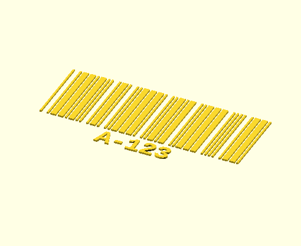
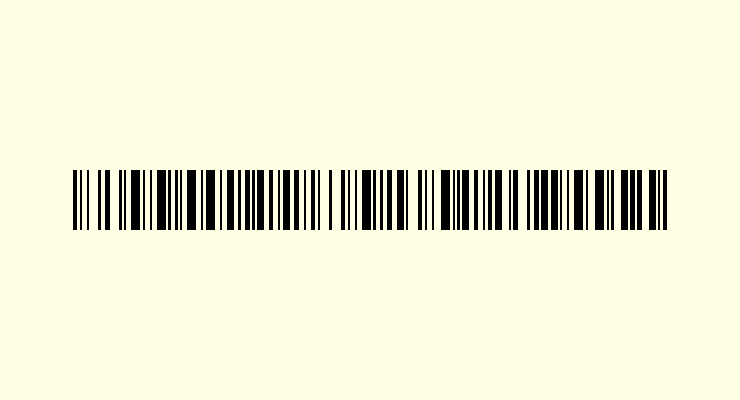

# Glyphinator
OpenSCAD Barcode Generator - useful for direct part marking on 3D models  
https://github.com/X-Illuminati/glyphinator/

---

## Usage Examples
Supported barcodes:
* UPC-A
* EAN-13
* Code 39
* Code 128
* DataMatrix (ECC200)
* Quick Response 2D barcodes

### UPC-A
Include upc.scad in your model with the `use` command.  
See the [UPC/EAN user-guide](doc/upc.md) for more details.

```
use <barcodes/upc.scad>
UPC_A("01234554321");
```


### EAN-13
Include upc.scad in your model with the `use` command.  
See the [UPC/EAN user-guide](doc/upc.md) for more details.

```
use <barcodes/upc.scad>
EAN_13("012345678901>");
```


### Code 39
Include code39.scad in your model with the `use` command.  
See the documentation in [code39.scad](barcodes/code39.scad) for more details.

```
use <barcodes/code39.scad>
code39("*A-123*", height=40, text="centered");
```




### Code 128
Include code128.scad in your model with the `use` command.  
See the documentation in [code128.scad](barcodes/code128.scad) for more details.

```
use <barcodes/code128.scad>
code_128(cs128_c([1,2,3,4]));
```




### DataMatrix
Include datamatrix.scad in your model with the `use` command.  
See the documentation in [datamatrix.scad](barcodes/datamatrix.scad) for more
details.

```
use <barcodes/datamatrix.scad>
data_matrix(dm_ascii("1234"));
```


### Quick Response
Include quick_response.scad in your model with the `use` command.  
See the documentation in [quick_response.scad](barcodes/quick_response.scad)
for more details.

```
use <barcodes/quick_response.scad>
quick_response(qr_numeric([0,1,2,3,4,5,6,7,8,9]));
```


### Generating Vector Images
OpenSCAD can generate 2D vector graphics with a few caveats.
To generate any of the barcodes using 2D vector geometry rather than 3D solid
geometry, simply add `vector_mode=true` to the barcode module parameters.

> 🪧 Note: The Code 39 implementation generates vectors by default.
> Use the linear_extrude command to expand these into 3D objects.

---

## Software License
Glyphinator is free software: you can redistribute it and/or modify
it under the terms of the **GNU Lesser General Public License** as published by
the Free Software Foundation, either **version 3 of the License, or
(at your option) any later version**.

Glyphinator is distributed in the hope that it will be useful,
but WITHOUT ANY WARRANTY; without even the implied warranty of
MERCHANTABILITY or FITNESS FOR A PARTICULAR PURPOSE.  See the
GNU Lesser General Public License for more details.

You should have received a copy of the GNU Lesser General Public License
along with Glyphinator.  If not, see <http://www.gnu.org/licenses/>.

### License Goals
1. Ensure that end-users who receive this software as part of a combined work
   can replace it with modified versions.
2. Ensure that combined works do not impose additional patent restrictions on
   end-users.
3. Disclaim any warranty as to the fitness of the program; especially since it
   is still a work-in-progress.

### License Notes
The copyright license applies only to the OpenSCAD libraries and other programs
provided in this repository. The output of these programs is explicitly not
covered by the terms of the license.
My expectation is that the generated 3D models are not subject to the terms of
copyright law and you may use these freely as far as I am concerned.

The terms of the GPL mainly concern themselves with software patents.
Unfortunately, most patent encumberances would likely be applied to the
resulting barcode object rather than the software that generates it.
I recommend consulting with a patent attorney before using any barcode
symbology if patent issues are a particular concern for you.

It is expected that most combined works will be in the form of an OpenSCAD
program that makes use of these libraries by way of the OpenSCAD "use" or
"include" statements. This will be sufficient to meet the terms of LGPLv3
section 4d1 as OpenSCAD will load the library at run time and will operate
properly with a version modified by an end-user.

It is conceivable that a combined work would use some other mechanism to make
use of these libraries. In this case, it may be necessary to provide
instructions to the end-user under the terms of LGPLv3 section 4d0 so that they
can replace these libraries with a modified version.

I don't believe that my goals or the LGPLv3 are overly onerous for use in any
reasonable combined work. (A reasonable combined work is one that is not
attempting to subvert my license goals stated above.) 
Please contact me (Chris Baker, X-Illuminati@github) if you believe the LGPLv3
license prevents you from creating a reasonable combined work with these
libraries.
