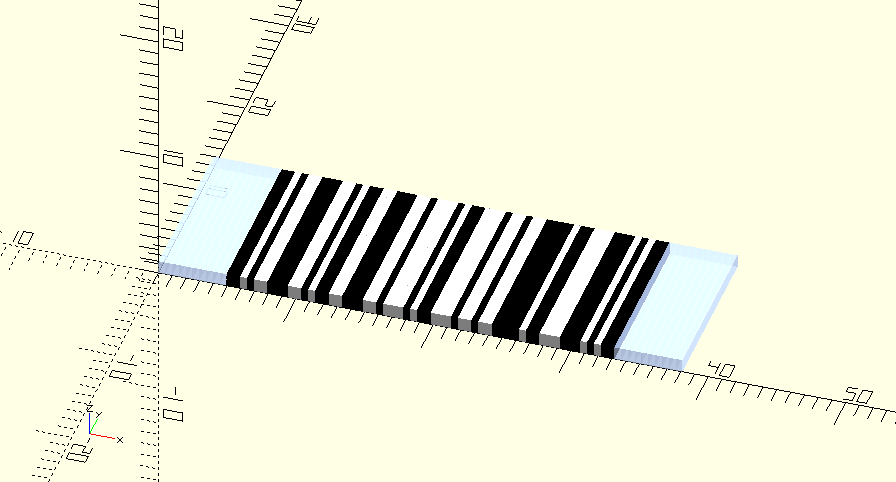

# Code 128 User Guide
This user-guide provides examples of how to use
[code128.scad](../barcodes/code128.scad) to generate Code 128 barcodes.  
Further information can be found by examining
[code128.scad](../barcodes/code128.scad) and related libraries like
[bitmap.scad](../util/bitmap.scad)

## Table of Contents
* [Code 128](#code-128)
  - [Basic Example](#basic-example)
  - [Module Description](#module-description)
  - [Helper Functions](#helper-functions)
  - [Checkdigit Handling](#checkdigit-handling)
* [Extended Examples](#extended-examples)
  - [Mixed Mode](#mixed-mode)
  - [Rendering Options](#rendering-options)
  - [Vector Mode](#vector-mode)
  - [FNC4 Mode](#fnc4-mode)

---

## Code 128
[Code 128](https://en.wikipedia.org/wiki/Code_128) is a variable length, high
density barcode symbology that is used extensively in the shipping and
package-handling industries.  
A Code 128 barcode consists of variable length encoded data followed by a
check symbol. This data section is surrounded by a start and stop symbol and a
quiet zone on both sides.

Code 128 can encode alphanumeric or numeric-only barcodes compactly, as well as
all 128 ASCII characters. This flexibility is provided by 3 different modes of
operation (known as code sets).
* Code Set A - ASCII characters 0-95 (including upper-case letters, digits, and control codes)
* Code Set B - ASCII characters 32-127 (including upper- and lower-case letters and digits)
* Code Set C - Pairs of decimal digits from 00-99

### Basic Example
Include code128.scad in your model with the `use` command.  
Provide a vector of codepoints generated with the
[helper functions](#helper-functions) as the parameter to the `code_128` module.

Code Set B example:
```
use <barcodes/code128.scad>
code_128(cs128_b("https://git.io/JfUro"));
```


Code Set C example:
```
use <barcodes/code128.scad>
code_128(cs128_c([1,2,3,4]));
```


### Module Description
```
module code_128(codepoints,
	bar=1, space=0, quiet_zone=0,
	pullback=-0.003,
	vector_mode=false,
	center=false,
	expert_mode=false)
```

This module generates the geometry for a Code 128 or GS1-128 barcode with the
supplied parameters.
* `codepoints`: a vector of codepoints to be encoded
  - use the [helper functions](#helper-functions) to generate a valid vector
* `bar`: representational unit for bars in the symbol
  - defaults to 1, a 1 mm tall block
  - can also be usefully set to "black" to generate black bars
* `space`: representation unit for spaces in the symbol
  - defaults to 0, which generates no geometry
  - can also usefully be set to "white" to generate white fill between bars
* `quiet_zone`: representation unit for the quient zone around the symbol
  - defaults to 0, which generates no geometry
  - can also usefully be set to "white" to generate white fill on both sides of the symbol
* `pullback`: a factor to apply to the individual modules of the symbol
  - it isn't normally necessary to modify this parameter
  - defaults to -0.003, which expands the modules slightly so that they will reliably combine into merged geometry
  - a positive pullback would shrink the modules slightly so that the wide bars would have gaps between the individual modules
* `vector_mode`: determines whether to generate 2D geometry rather than 3D
  - defaults to false
* `center`: determines whether to center the symbol on the origin
  - defaults to false
* `expert_mode`: never use
  - defaults to false
  - allows generation of noncompliant barcodes for testing


### Helper Functions
```
function NUL()  = "\uE000";
function FNC1() = "\uE001";
function FNC2() = "\uE002";
function FNC3() = "\uE003";
function FNC4() = "\uE004";

function cs128_a(string, concatenating=false)
function cs128_b(string, concatenating=false)
function cs128_c(digits, concatenating=false)
function cs128_shift_a(character)
function cs128_shift_b(character)
function cs128_fnc4_high_helper(string)
function code_128_width(codepoints, expert_mode=false)
```

The `NUL`, `FNC1`, `FNC2`, `FNC3`, and `FNC4` helpers provide an easy way to
insert the corresponding characters into your codepoints vector.  
The FNC characters aren't part of the normal ASCII or Unicode set and the NUL
character would interfere with the normal string handling of OpenSCAD if it was
directly included.

The `cs128_a` function takes an ASCII string as input and returns a vector of
codepoints that encode those characters in code set A.
* `string`: the ASCII string to encode
  - control codes can be placed in the string using "\x01"-"\x1F" or standard escape codes like "\t"
  - other control codes like NUL and FNCx can be encoded using the Unicode private-use values mentioned above
  - invalid characters (like lower-case letters) will be ignored
* `concatenating`: indicates whether this vector will be concatenated with a previous code set A vector
  - defaults to false
  - this is primarily for convenience in case you want to build up your vector by concatenating pieces together
  - setting this to true will suppress the normal start code that is prepended to the vector
  - if you aren't already in code set A mode, the vector generated here will be interpreted in a nonsensical fashion

The `cs128_b` function takes an ASCII string as input and returns a vector of
codepoints that encode those characters in code set B.
* `string`: the ASCII string to encode
  - the ASCII DEL character can be encoded as "\x7F"
  - other control codes like NUL and FNCx can be encoded using the Unicode private-use values mentioned above
  - invalid characters (like control codes) will be ignored
* `concatenating`: indicates whether this vector will be concatenated with a previous code set B vector
  - defaults to false
  - this is primarily for convenience in case you want to build up your vector by concatenating pieces together
  - setting this to true will suppress the normal start code that is prepended to the vector
  - if you aren't already in code set B mode, the vector generated here will be interpreted in a nonsensical fashion

The `cs128_c` function takes a vector of individual digits as input and returns
a vector of codepoints that encode those digits in code set C.
* `digits`: the vector of digits to encode
  - the digits must be paired as consecutive entries in the vector (any extra odd digit will be ignored)
  - the control code `FNC1()` can be included in the vector, but beware the previous point if there are an odd number of digits before it, the last one will be ignored
  - invalid digits (numbers outside the range 0-9) will be ignored
* `concatenating`: indicates whether this vector will be concatenated with a previous code set C vector
  - defaults to false
  - this is primarily for convenience in case you want to build up your vector by concatenating pieces together
  - setting this to true will suppress the normal start code that is prepended to the vector
  - if you aren't already in code set C mode, the vector generated here will be interpreted in a nonsensical fashion

The `cs128_shift_a` function takes a single character as input and returns a
vector composed of the Shift A symbol followed by the character encoded in code
set A.
* `character`: the character to encode
  - must be a valid character in code set A (invalid characters will be ignored)
  - the Shift A symbol is only valid in code set B, so you must already be in code set B mode to concatenate the results of this function with your existing vector

The `cs128_shift_b` function takes a single character as input and returns a
vector composed of the Shift B symbol followed by the character encoded in code
set B.
* `character`: the character to encode
  - must be a valid character in code set B (invalid characters will be ignored)
  - the Shift B symbol is only valid in code set A, so you must already be in code set A mode to concatenate the results of this function with your existing vector

The `cs128_fnc4_high_helper` function can allow high-ASCII characters (128-255)
to be encoded. This is non-standard and reported to be not widely supported.
* `string`: string of high-ASCII characters
  - this function merely subtracts 128 from the value of each character and returns a string of the now shifted low-ASCII results
  - the results need to have correct `FNC4` codes for the desired shift or mode-switch behavior, this function does not insert them
  - the results of this function still need to be passed to `cs128_a` or `cs128_b` to convert them to a vector of codepoints

The `code_128_width` function computes the width (in mm) of the generated symbol
(including quiet zone).
* `codepoints`: the same codepoints as would be passed to the `code_128` module
* `expert_mode`: use the same value as will be passed to the `code_128` module

### Checkdigit Handling
The check digit will be computed automatically.

> ⚠️ Caution:  
> If expert mode is used, you will have to supply your own check digit (as well
> as other furniture around your code points) and the check digit will not be
> validated for correctness. See [code128.scad](../barcodes/code128.scad) for
> information about the `calculate_checkdigit` function which may be useful.

---

## Extended Examples

### Mixed Mode
It is reasonable to concatenate the resulting vectors from `cs128_a`, `cs128_b`,
and `cs128_c`. These vectors will each have a start symbol for the defined mode
at the beginning of them and the `code_128` module will first normalize the
vector by converting the internal start symbols to switch symbols.  
Here is a typical example combining code set C with code set A (note the 5
cannot be part of the `cs128_c` call because it would be un-paired):
```
code_128(concat(cs128_c([1,2,3,4]), cs128_a("5ABC")), bar="black");
```


However, the normalization process won't detect and remove extraneous start
symbols; so, concatenating the result of two `cs128_a` calls will have an extra,
incorrect symbol. In the case mentioned (concatenating two `cs128_a` outputs),
since there is no switch A symbol in code set A, the codepoint resulting from
normalization will be misinterpreted as FNC4.  
This is where you would need to employ the `concatenating=true` option for the
second call to `cs128_a` to avoid inserting the Start A symbol.  
Alternately, you could `str`-cat your two strings and only call `cs128_a` once
with the combined result.  
So, for example, all 3 of these commands will result in the same generated
geometry:
```
code_128(concat(cs128_a("1234"), cs128_a("ABCD", concatenating=true)),
	bar="black");
code_128(cs128_a(str(1234,"ABCD")), bar="black");
code_128(cs128_a(str("1234","ABCD")), bar="black");
```


> Excercise for the reader: why can't we use `cs128_a(concat("1234","ABCD"))` in
> the previous example?

### Rendering Options
The `bar`, `space`, and `quiet_zone` parameters can be used to modify the generated geometry or the preview rendering. The general expectation is that the
symbol will be embossed or debossed on another object. For this reason, the
default parameters result in a simple 1-unit-tall geometry for the bars and no
geometry for the spaces and quiet zone.  
However, it can be helpful to color the symbol for reasons that I haven't
anticipated. (And, at the very least, it can help make your screen-shots look
prettier.)

Each of these parameters can take a rational value that represents the height of
the respective geometry.  
For example:
```
code_128(cs128_c([1,2,3,4]), bar=5, space=3, quiet_zone=1);
```


Likewise, each of them can take a string value that represents a color. There is
a description of valid hex strings and a list of standard color names
available in the [OpenSCAD User Manual](https://en.wikibooks.org/wiki/OpenSCAD_User_Manual/Transformations#color).

> 🪧 Note: OpenSCAD only displays colors in the preview. When rendering the
> object, the color information will be discarded.


Example:
```
code_128(cs128_c([1,2,3,4]), bar="#000", space="white", quiet_zone="#A0BBF0B0");
```


Finally, a 3- or 4-vector can be passed to these parameters to indicate the
desired color as [R, G, B] or [R, G, B, A]. (Note: values for each color channel
are expressed as rational numbers between 0.0 and 1.0.)  
This example represents the same colors as the previous example:
```
code_128(cs128_c([1,2,3,4]), bar=[0,0,0], space=[1,1,1],
	quiet_zone=[0.625, 0.73, 0.9375, 0.6875]);
```

### Vector Mode
The `code_128` module will emit 2D geometry rather than 3D if you pass a value
of true in the `vector_mode` parameter:
```
code_128(cs128_c([1,2,3,4]), vector_mode=true);
```


> 🪧 Note:  
> Although OpenSCAD supports generating 2D geometry, there are several caveats:
> * 2D and 3D geometry cannot be mixed in the same design
> * Extruding 2D geometry causes loss of color information
> * Previewing 2D geometry makes it appear as though it is 1 unit tall and centered on the z-axis
> * Rendering 2D geometry properly displays it as a flat object but results in the loss of color information
> * The exporters for 2D geometry are somewhat limited
>   - See the note in [bitmap.scad](../util/bitmap.scad) for some work-arounds

### FNC4 Mode
High-ASCII characters (128-255) can supposedly be encoded by using FNC4 as a
special shift character. This allows encoding latin-1 codepoints. (And possibly
shift-JIS?)  
Although this is supposed to be very non-standard, 3 out of 4 Android barcode
scanner apps that I tried were able to decode the following example as
"ABC¡!¢£¤¥Þ^ÀÁÂÃXYZ":
```
// ABC ¡ ! ¢£¤¥Þ ^ ÀÁÂà XYZ
// low h l high  l high low ASCII
code_128(cs128_a(str("ABC", FNC4(), cs128_fnc4_high_helper("¡"), "!",
	cs128_fnc4_high_helper(str(FNC4(), FNC4(), "¢£¤¥Þ", FNC4())), "^",
	cs128_fnc4_high_helper("ÀÁÂÃ"), FNC4(), FNC4(), "XYZ")),
	bar="black");
```

