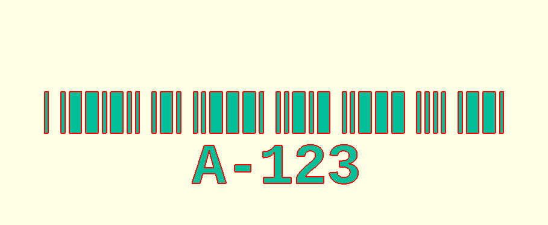
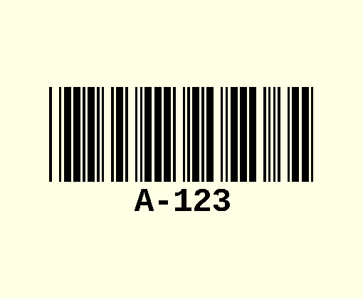

# Code-39 User Guide
This user-guide provides examples of how to use
[code39.scad](../barcodes/code39.scad) to generate Code 39 barcodes.  
Further information can be found by examining that file.

## Table of Contents
* [Code 39](#code-39)
  - [Basic Example](#basic-example)
  - [Module Description](#module-description)
  - [Helper Functions](#helper-functions)
* [Extended Examples](#extended-examples)
  - [Text Label](#text-label)
  - [Rendering Options](#rendering-options)
  - [3D Geometry](#3d-geometry)

---

## Code 39
[Code 39](https://en.wikipedia.org/wiki/Code_39) is a variable length, low
density barcode symbology that can encode the letters A-Z, numbers 0-9, and
symbols - . $ / + % and space.  
It has a single control character (denoted *) used as a start and stop code.  
There is no check digit, but a single corrupted bar in any given symbol would
not result in misinterpreting it as a different symbol.


### Basic Example
Include code39.scad in your model with the `use` command.  
Provide a string of valid characters to the `code39` module. You should include
'*' characters at the beginning and end to serve as the start and stop
characters (without which you won't have a valid barcode).

```
use <barcodes/code39.scad>
code39("*A-123*");
```


### Module Description
```
module code39(code, height=10, unit=1, text=false, center=false)
```

This module generates the geometry for the Code 39 barcode with the supplied
parameters.
* `code`: a string of valid characters to be encoded
  - should start and end with a '*' character
  - there is very little error checking, but you will get an error if you use an invalid character
* `height`: the height of each bar in the barcode (along the y-axis)
  - defaults to 10
  - a value of 2 to 5 times the unit size is probably most aesthetically pleasing
* `unit`: the width of a "thin" bar or space
  - defaults to 1
* `text`: sets the mode for displaying text below the barcode
  - false: text will not be displayed (default)
  - "char": each character will be displayed below its respective symbol
  - "centered": the entire string will be centered below the barcode
* `center`: determines whether to center the symbol on the origin
  - defaults to false

> 🪧 Note: The font is hard-coded as "Courier New:style=Bold" and the text size
> is 10 times the unit size.


### Helper Functions
```
function code39_width(code, unit=1)
```

The `code39_width` function computes the width of the generated symbol.
* `code`: the string of characters that would be passed to the `code39` module
* `unit`: the width of a "thin" bar or space
  - defaults to 1
  - should match the value you will pass to the `code39` module

> 🪧 Note: There is a thin space between each symbol in the barcode and this is
> often included as part of each symbol when the implementation provides the
> symbol mapping as a "barcode font".
>
> This function calculation does not include such a space at the very end of the
> barcode (e.g. as part of the final '*' stop symbol).
> Likewise, it does not include any quiet zone that may need to be placed on
> either side of the barcode.

---

## Extended Examples

### Text Label
A text label can be added beneath the barcode. There are 2 options for this:
"char" and "centered". The best way to demonstrate the difference is by an
example.

```
code39("*A-123*", text="char");
```


```
code39("*A-123*", text="centered");

```


Note that the '*' start and stop characters are not displayed in the text label.

> 🪧 Note: The font is hard-coded as "Courier New:style=Bold" and the text size
> is 10 times the unit size.

### Rendering Options
The `height`, and `unit` parameters can be used to modify the generated geometry of the barcode.

Each of these parameters can take a rational value that represents the height or
width multiplier for the size of each unit bar that makes up the symbols of the
barcode.

```
code39("*A-123*", height=40, text="centered");
```


```
code39("*A-123*", unit=2, text="centered");
```


### 3D Geometry
The `code39` module will emit 2D vector geometry by default. The
`linear_extrude` command can be used to extend it in the z-axis in order to
create 3D Geometry
```
linear_extrude(10)
code39("*A-123*", height=40, text="centered");
```


> 🪧 Note: if you pass the center=true parameter to the `code39` module, you
> will probably also want to pass it to the `linear_extrude` command as well.
