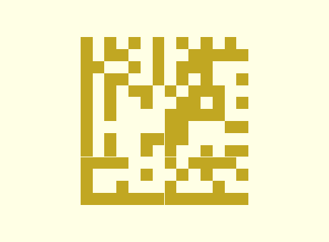
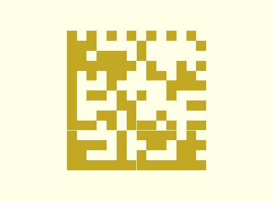
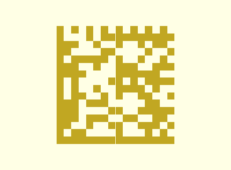
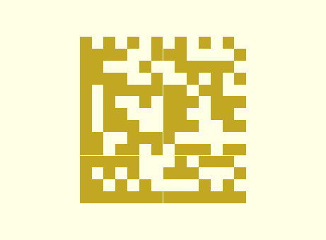
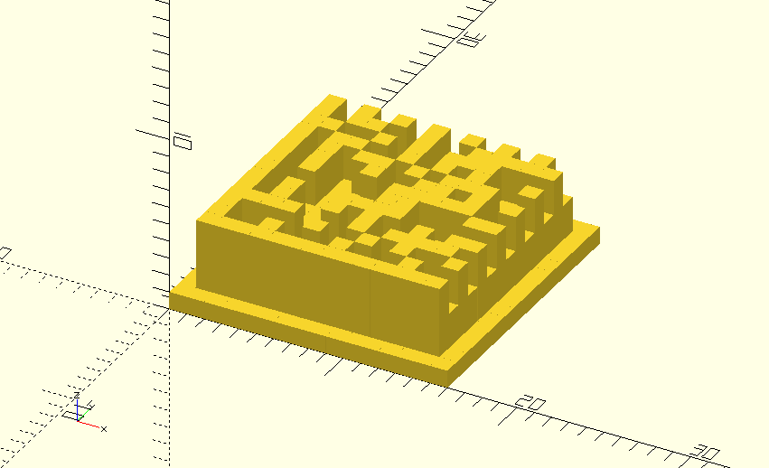
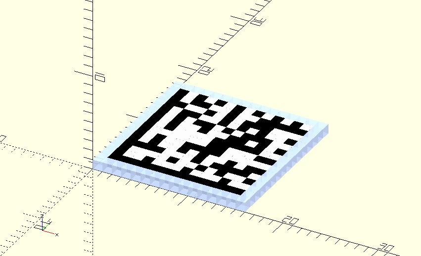
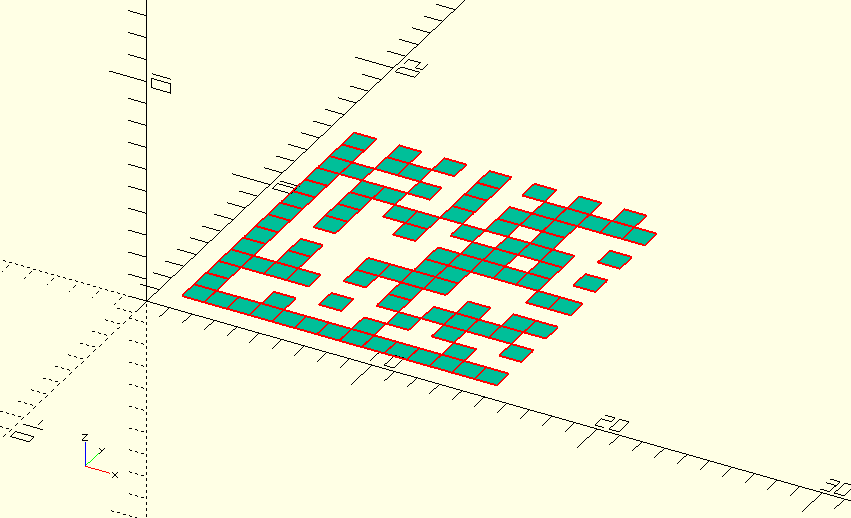

# Data Matrix User Guide
This user-guide provides examples of how to use
[datamatrix.scad](../barcodes/datamatrix.scad) to generate Data Matrix codes.  
Further information can be found by examining
[datamatrix.scad](../barcodes/datamatrix.scad) and related libraries like
[bitmap.scad](../util/bitmap.scad)

## Table of Contents
* [Data Matrix](#data-matrix)
  - [Basic Example](#basic-example)
  - [Module Description](#module-description)
  - [Helper Functions](#helper-functions)
  - [ECC Handling](#ecc-handling)
* [Extended Examples](#extended-examples)
  - [Mixed Mode](#mixed-mode)
  - [Base256 Mode](#base256-mode)
  - [Rendering Options](#rendering-options)
  - [Vector Mode](#vector-mode)

---

## Data Matrix
[Data Matrix](https://en.wikipedia.org/wiki/Data_Matrix) is a compact,
two-dimensional code symbology that is used extensively in manufacturing
industries for marking and tracking small parts. The marks (known as cells) are
typically printed in black on a white background, but they can also be laser- or
chemically-etched, peened, or stamped into a surface.  
This library currently supports square symbols from 10x10 to 26x26 with ECC 200
(Reed-Solomon error correction).

Data Matrix encodes data as 8-bit codewords. There are several different modes
available for encoding data as codewords:
* ASCII Mode (default): Encodes ASCII data (characters 1-128) and pairs of digits 00-99
* Base256 Mode: Encodes raw bytes naturally by preceding them with a length indicator (mode switching escape codes are therefore not needed in the data encoding)
* Text modes: Encodes 3 characters as 2 bytes
  - Text Mode: Numbers, lower-case letters, control-codes and symbols via shift character, and upper-case letters via shift character
  - C40 Mode: Numbers, upper-case letters, control-codes and symbols via shift character, and lower-case letters via shift character
  - X12 Mode: Upper-case letters, numbers, and limited symbols (*, >, space, CR)
* EDIFACT Mode: Encodes 4 characters as 3 bytes; only supports ASCII characters 32-94

> 🪧 Note: X12 and EDIFACT mode are not currently supported by this library.

### Basic Example
Include datamatrix.scad in your model with the `use` command.  
Provide a vector of bytes generated with the
[helper functions](#helper-functions) as the parameter to the `data_matrix`
module.

ASCII Mode example:
```
use <barcodes/datamatrix.scad>
data_matrix(dm_ascii("Abcd1234"));
```


### Module Description
```
module data_matrix(bytes,
	mark=1, space=0, quiet_zone=0,
	pullback=0.003,
	vector_mode=false,
	center=false,
	expert_mode=false)
```

This module generates the geometry for a Data Matrix symbol with the supplied
parameters.
* `bytes`: a vector of bytes to be encoded
  - use the [helper functions](#helper-functions) to generate a valid vector
* `mark`: representational unit for dark cells or marks
  - defaults to 1, a 1 mm cube
  - can also be usefully set to "black" to generate black cubes
* `space`: representation unit for spaces or light cells
  - defaults to 0, which generates no geometry
  - can also usefully be set to "white" to generate white cubes
* `quiet_zone`: representation unit for the quiet zone around the symbol
  - defaults to 0, which generates no geometry
  - can also usefully be set to "white" to generate a white border around the symbol
* `pullback`: a factor to apply to the individual modules of the symbol
  - it isn't normally necessary to modify this parameter
  - defaults to 0.003, which shrinks the cells slightly so that they will reliably separate from one another
  - a negative pullback would expand the cells slightly so that they combine into more unified blobs rather than creating a screen-door effect
* `vector_mode`: determines whether to generate 2D geometry rather than 3D
  - defaults to false
* `center`: determines whether to center the symbol on the origin
  - defaults to false
* `expert_mode`: never use
  - defaults to false
  - allows generation of noncompliant symbols for testing
  - might allow manual creation of symbols with unimplemented encoding modes

### Helper Functions
```
function c40_mode() = 230;     // begin C40 encoding mode
function base256_mode() = 231; // begin base-256 (byte) encoding mode
function fnc1_mode() = 232;    // begin FNC1 (GS1-DataMatrix) encoding mode
function text_mode() = 239;    // begin text encoding mode
function ascii_mode() = 254;   // return to ASCII encoding mode

function data_matrix_size(bytes, expert_mode=false)
function dm_ascii(string, frob_digits=true)
function dm_text(string)
function dm_c40(string)
function dm_base256(data, pos, fills_symbol=false)
function dm_base256_append(preceding_data, byte_data, fills_symbol=false)
```

The different *_mode helpers provide an easy way to insert the corresponding
control characters into your bytes vector. `ascii_mode` is really only valid
if you are already in C40 or Text mode.  
`fnc1_mode` is only valid in ASCII mode and is not a separate mode as such.
Rather, it indicates the following bytes would be interpreted according to the
GS1 standards. So, this is more of an application mode rather than an encoding
mode.

The `data_matrix_size` function computes the overall dimensions of the generated
symbol (including quiet zone) and returns it as a 2-vector. (E.G. it would
return [12,12] for a 10x10 symbol.)
* `bytes`: the same bytes vector as would be passed to the `data_matrix` module
* `expert_mode`: use the same value as will be passed to the `data_matrix` module

The `dm_ascii` function takes an ASCII string as input and returns a byte array
that encodes those characters in the Data Matrix ASCII encoding.
* `string`: the ASCII string to encode
  - control codes can be placed in the string using "\x01"-"\x1F" or standard escape codes like "\t"
  - Null character "\0" is not allowed
  - invalid characters may be ignored or converted in unexpected ways
* `frob_digits`: compact pairs of digits into a singly byte
  - defaults to true
  - the ASCII encoding has a range of bytes for encoding pairs of digits 00-99 as a single byte
  - disabling this option would keep them as separate bytes (each encoded as 0x30-0x39 as usual)
  - this is provided mainly for compatibility with other tools that might not have implemented digit-pair-compaction

The `dm_text` function takes an ASCII string as input and returns a byte array
that encodes those characters in the Text mode encoding.
* `string`: the ASCII string to encode
  - invalid characters will be ignored
  - upper-case letters will have a slight encoding penalty
  - total number of characters plus necessary shift characters must add up to a multiple of 3 (excess characters will be ignored)
  - 🪧 Note: you will need to prepend the output of this function with `text_mode()` in order to switch from ASCII mode to Text mode

The `dm_c40` function takes an ASCII string as input and returns a byte array
that encodes those characters in the C40 mode encoding.
* `string`: the ASCII string to encode
  - invalid characters will be ignored
  - lower-case letters will have a slight encoding penalty
  - total number of characters plus necessary shift characters must add up to a multiple of 3 (excess characters will be ignored)
  - 🪧 Note: you will need to prepend the output of this function with `c40_mode()` in order to switch from ASCII mode to C40 mode

The `dm_base256` takes a byte array as input and returns a byte array that
encodes those bytes with the base256 pseudo-random masking pattern and with the 1 or 2 length bytes prepended.
* `data`: the byte array to encode
  - 🪧 Note: you will need to prepend the output of this function with `base256_mode()` in order to switch from ASCII mode to Base256 mode
* `pos`: the position that this data is starting at within the overall symbol
  - this is necessary for the correct masking pattern calculation
  - see the `dm_base256_append` helper function, which makes this easier
* `fills_symbol`: indicates that the `data` vector fills out the remainder of the symbol
  - defaults to false
  - if true, the length will just be hardcoded to 0
  - it isn't recommended to use this as it would be a very niche scenario where it provided any benefit

The `dm_base256_append` function helps with the use of `dm_base256` by computing the `pos` field for you.
* `preceding_data`: the byte array that contains all of the preceding data for the symbol
  - this will be concatenated with the output of `dm_base256`
  - the final byte in this array must be `base256_mode()`
  - `len(preceding_data)` will be passed as the `pos` parameter to `dm_base256`
* `byte_data`: the byte array to encode
* `fills_symbol`: passed directly to `dm_base256`

### ECC Handling
This library implements only ECC 200, the newer version of Data Matrix, which
uses Reed-Solomon error correction over the finite field 𝔽₂₅₆.  
The `data_matrix` module automatically calculates these ECC bytes based on the
byte array that is passed to it as an input.  
The implementation is supplied in
[reed-solomon-datamatrix.scad](../util/reed-solomon-datamatrix.scad) for those
interested.

> ⚠️ Caution:  
> If expert mode is used, you will have to supply your own padding and ecc bytes
> -- none of which will be validated for correctness.
> See [datamatrix-util.scad](../util/datamatrix-util.scad) for information about
> the `dm_ecc` and `dm_pad` functions, which may be useful.

---

## Extended Examples

### Mixed Mode
It is reasonable to concatenate the resulting vectors from `dm_ascii`,
`dm_text`, `dm_c40`, and `dm_base256` so long as the appropriate mode-switch
bytes are interspersed between them.  
Here is a modification of the simple example above to combine Text mode with ASCII mode:
```
data_matrix(
	concat(
		dm_ascii("A"),
		text_mode(),dm_text("bcd"),
		ascii_mode(),dm_ascii("1234")
	)
);
```
  
Note that the resulting concatenated byte vector is actually longer in this
example than the original. It is not always clear what the best way to optimize
a particular string will be due to the overhead of mode switching and the
restrictions of the various text modes. (Also, the default ASCII mode is
actually reasonably efficient for most use-cases.)

### Base256 Mode
Base256 mode can be a little trickier to use. It is easiest to use with the
help of `dm_base256_append` and when used in only the simplest mixed-mode
use-case.

Here is an example of our familiar example string, "Abcd1234" encoded in
Base256 mode:
```
// [65,98,99,100,49,50,51,52] = ASCII A,b,c,d,1,2,3,4
data_matrix(dm_base256_append([base256_mode()],[65,98,99,100,49,50,51,52]));
```


We could also have used `dm_base256` directly as this example is simple enough:
```
data_matrix(
	concat(
		base256_mode(),
		dm_base256([65,98,99,100,49,50,51,52], pos=1) // A,b,c,d,1,2,3,4
	)
);
```

However, the value of the helper function is more clear if we are appending to a
more complicated preceding byte array.  
For example:
```
// case 1
data_matrix(
	concat(
		dm_ascii("Abcd12"),
		base256_mode(),
		dm_base256([51,52], pos=7) // 3,4
	)
);

// case 2
data_matrix(
	concat(
		dm_ascii("Abcd12"),
		base256_mode(),
		dm_base256([51,52], pos=6) // 3,4
	)
);

// case 3
data_matrix(
	dm_base256_append(
		concat(dm_ascii("Abcd12"), base256_mode()),
		[51,52] // 3,4
	)
);
```
Here it is not obvious whether case 1 or 2 are correct. (It is actually case 2
due to the compaction of "12" into a single byte in ASCII mode.) Here, case 3
is much simpler because there is no need to worry about correctly computing the
length of the preceding data bytes.

As a final example, we will show that Base256 mode is automatically terminated
so there is no need to provide a mode-switch command to return to ASCII mode:
```
data_matrix(
	concat(
		dm_base256_append(
			concat(dm_ascii("A"), base256_mode()),
			[98,99,100] // b,c,d
		),
		dm_ascii("1234")
	)
);
```


### Rendering Options
The `mark`, `space`, and `quiet_zone` parameters can be used to modify the generated geometry or the preview rendering. The general expectation is that the
symbol will be embossed or debossed on another object. For this reason, the
default parameters result in a simple 1-unit-tall geometry for the dark cells
and no geometry for the light cells or quiet zone.  
However, it can be helpful to color the symbol for reasons that I haven't
anticipated. (And, at the very least, it can help make your screen-shots look
prettier.)

Each of these parameters can take a rational value that represents the height of
the respective geometry.  
For example:
```
data_matrix(dm_ascii("Abcd1234"), mark=5, space=3, quiet_zone=1);
```


Likewise, each of them can take a string value that represents a color. There is
a description of valid hex strings and a list of standard color names
available in the [OpenSCAD User Manual](https://en.wikibooks.org/wiki/OpenSCAD_User_Manual/Transformations#color).

> 🪧 Note: OpenSCAD only displays colors in the preview. When rendering the
> object, the color information will be discarded.


Example:
```
data_matrix(dm_ascii("Abcd1234"), mark="#000", space="white",
	quiet_zone="#A0BBF0B0");
```


Finally, a 3- or 4-vector can be passed to these parameters to indicate the
desired color as [R, G, B] or [R, G, B, A]. (Note: values for each color channel
are expressed as rational numbers between 0.0 and 1.0.)  
This example represents the same colors as the previous example:
```
data_matrix(dm_ascii("Abcd1234"), mark=[0,0,0], space=[1,1,1],
	quiet_zone=[0.625, 0.73, 0.9375, 0.6875]
```

### Vector Mode
The `data_matrix` module will emit 2D geometry rather than 3D if you pass a
value of true in the `vector_mode` parameter:
```
data_matrix(dm_ascii("Abcd1234"), vector_mode=true);
```


> 🪧 Note:  
> Although OpenSCAD supports generating 2D geometry, there are several caveats:
> * 2D and 3D geometry cannot be mixed in the same design
> * Extruding 2D geometry causes loss of color information
> * Previewing 2D geometry makes it appear as though it is 1 unit tall and centered on the z-axis
> * Rendering 2D geometry properly displays it as a flat object but results in the loss of color information
> * The exporters for 2D geometry are somewhat limited
>   - See the note in [bitmap.scad](../util/bitmap.scad) for some work-arounds
