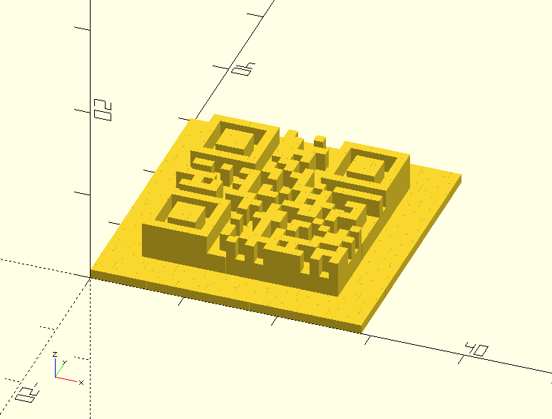

# Quick Response User Guide
This user-guide provides examples of how to use
[quick_response.scad](../barcodes/quick_response.scad) to generate Quick
Response codes.  
Further information can be found by examining
[quick_response.scad](../barcodes/quick_response.scad) and related libraries
like [bitmap.scad](../util/bitmap.scad) and [stringlib.scad](../util/stringlib.scad).

## Table of Contents
* [Quick Response](#quick-response)
  - [Basic Example](#basic-example)
  - [Module Description](#module-description)
  - [Helper Functions](#helper-functions)
  - [ECC Handling](#ecc-handling)
* [Extended Examples](#extended-examples)
  - [Mixed Mode](#mixed-mode)
  - [Byte Mode](#byte-mode)
  - [Rendering Options](#rendering-options)
  - [Vector Mode](#vector-mode)

---

## Quick Response
[Quick Response Code](https://w.wiki/RNa) is a two-dimensional code symbology
that originated in the automotive industry for part labeling and tracking. It is
now used extensively for sharing URLs that can be scanned with a smartphone and
commonly in augmented reality systems for tracking and tagging objects.  
This library currently supports symbols up to version 6.

Quick Response encodes data as 8-bit codewords. However, within these codewords
there are different modes of compaction based on a TLV approach. The type is 4
bits followed by a length that depends on the type.  
The native modes for a quick response code are:
* Numeric: encodes 3 digits in 10 bits
* Alphanumeric: encodes 2 characters in 11 bits (digits, upper-case letters, and selected symbols - space, $, %, *, +, -, ., /, :)
* Byte: encodes raw bytes directly
* Kanji: encodes Kanji characters with 13 bits each

> 🪧 Note: Kanji mode is not currently supported by this library.

### Basic Example
Include quick_response.scad in your model with the `use` command.  
Provide a vector of bytes generated with the
[helper functions](#helper-functions) as the parameter to the `quick_response`
module.

Alphanumeric example:
```
use <barcodes/quick_response.scad>
quick_response(qr_alphanum("ABCD1234"));
```


### Module Description
```
module quick_response(bytes,
	ecc_level=2, mask=0, version=undef,
	mark=1, space=0, quiet_zone=0,
	pullback=0.003,
	vector_mode=false,
	center=false,
	expert_mode=false)
```

This module generates the geometry for a Quick Response symbol with the supplied
parameters.
* `bytes`: a vector of bytes to be encoded
  - use the [helper functions](#helper-functions) to generate a valid vector
* `ecc_level`: specify the level of error correction desired
  - defaults to 2
  - more error correction will result in a larger symbol
  - 0=Low  (~7.5% correctable errors)
  - 1=Mid  (~15% correctable errors)
  - 2=Q    (~22.5% correctable errors)
  - 3=High (~30% correctable errors)
* `mask`: specify the desired mask pattern
  - defaults to 0
  - this pattern is used to break up the symbol to avoid large dark or light regions, or regions that could result in false-positive matches for the locator marks
  - 0=checkerboard (fine)
  - 1=rows
  - 2=columns
  - 3=diagonals
  - 4=checkerboard (coarse)
  - 5=* tiles
  - 6=<> tiles
  - 7=bowties
* `version`: manually specify the version
  - defaults to `undef`, resulting in automatic version selection
  - normally not needed unless you want to have a larger symbol than necessary
* `mark`: representational unit for marks
  - defaults to 1, a 1 mm cube
  - can also be usefully set to "black" to generate black cubes
* `space`: representation unit for spaces
  - defaults to 0, which generates no geometry
  - can also usefully be set to "white" to generate white cubes
* `quiet_zone`: representation unit for the quiet zone around the symbol
  - defaults to 0, which generates no geometry
  - can also usefully be set to "white" to generate a white border around the symbol
* `pullback`: a factor to apply to the individual modules of the symbol
  - it isn't normally necessary to modify this parameter
  - defaults to 0.003, which shrinks the cells slightly so that they will reliably separate from one another
  - a negative pullback would expand the cells slightly so that they combine into more unified blobs rather than creating a screen-door effect
* `vector_mode`: determines whether to generate 2D geometry rather than 3D
  - defaults to false
* `center`: determines whether to center the symbol on the origin
  - defaults to false
* `expert_mode`: never use
  - defaults to false
  - allows generation of noncompliant symbols for testing
  - might allow manual creation of symbols with unimplemented encoding modes

> 🪧 Note: The bytes vector can be a straightforward array of byte values, but
> most of the encoding modes end up with odd-size bit-fields for their logical
> elements. For this reason, the helper functions will return an array of
> `qr_bitfield` elements. Each of these is a 2-tuple composed of the bit length
> and value. Internally, the `quick_response` module will compact these before
> processing and generating the symbol geometry.  
> You can freely `concat` the individual payload vectors generated by the helper
> functions and the compaction process will handle merging these into an array
> of bytes.

### Helper Functions
```
quick_response_size(bytes, ecc_level=2, version=undef, expert_mode=false)
qr_bytes(data)
qr_numeric(digits)
qr_alphanum(string)
```

The `quick_response_size` function computes the overall dimensions of the
generated symbol (including quiet zone) and returns it as a 2-vector. (E.G. it
would return [49,49] for a Version 6 symbol.)
* `bytes`: the same bytes vector as would be passed to the `quick_response` module
* `ecc_level`: specify the same version as will be passed to the `quick_response` module
* `version`: use the same value as will be passed to the `quick_response` module
* `expert_mode`: use the same value as will be passed to the `quick_response` module

The `qr_bytes` function takes an array of byte values as an input and returns an
array of vectors in the expected TLV format for the `quick_response` module.
* `data`: an array of byte values to encode
  - `ascii_to_vec` from [stringlib.scad](../util/stringlib.scad) may be useful for conversion from string to bytes

The `qr_numeric` function takes an array of digits as an input and returns an
array of vectors in the expected TLV format for the `quick_response` module.
* `digits`: an array of digits to encode
  - `atoi` from [stringlib.scad](../util/stringlib.scad) may be useful for conversion from string to digits

The `qr_alphanum` function takes a string as input and returns an array of
vectors in the expected TLV format for the `quick_response` module.
* `string`: the string to encode
  - invalid characters in the string will be ignored

### ECC Handling
This library implements the error correction used for Quick Response codes. The
details depend on the symbol Version and error correction level desired.
They are all implemented as a Reed-Solomon error correction over the finite
field 𝔽₂₅₆ with primitive polynomial 285.  
The `quick_response` module automatically calculates these ECC bytes based on
the byte array that is passed to it as an input.  
The implementation is supplied in
[reed-solomon-quick_response.scad](../util/reed-solomon-quick_response.scad) for
those interested.

> ⚠️ Caution:  
> If expert mode is used, you will have to supply your own padding and ecc bytes
> -- none of which will be validated for correctness.
> See [quick_response-util.scad](../util/quick_response-util.scad) for
> information about the `qr_ecc`, `qr_pad`, and other helper functions, which
> may be useful.

---

## Extended Examples

### Mixed Mode
It is reasonable to concatenate the resulting vectors from `qr_bytes`,
`qr_numeric`, and `qr_alphanum`. The TLV encoding means that each of these
vectors are independently encoded and there are no special escape codes needed
to change between them.
Here is a modification of the simple example above to combine Alphanumeric mode
with Numeric mode:
```
quick_response(concat(qr_alphanum("ABCD"), qr_numeric([1,2,3,4])));
```
  
Note that the resulting concatenated vector is actually longer by a few bits in
this example than the original. This isn't particularly surprising since we will
have some over head from the type and length encoding of the second payload
bitstream. In this case we are also using the Numeric mode inefficiently since
we don't have a multiple of 3 digits.  
It is not always clear what the best way to optimize a particular payload will
be due to the overhead of mode switching and the restrictions of the various
modes. In general, this is a matter of experimentation.

> 💡 Tip: You may find the `qr_compact_data` function from
> [quick_response-util.scad](../util/quick_response-util.scad) to be helpful in
> determining the actual byte length of your payload bitstreams.  
> Taking `len` of the result will indicate the number of bytes needed to encode
> your payload.

### Byte Mode
Byte mode is relatively straightforward when you want to encode raw data
bytes -- simply supply your byte vector to the `qr_bytes` helper.  
Encoding longer strings of ASCII text, can be tedious, though. The
`ascii_to_vec` utility from [stringlib.scad](../util/stringlib.scad) can help
with this.  
In this example, both lines generate identical symbols:
```
quick_response(qr_bytes(ascii_to_vec("ABCD1234")));
quick_response(qr_bytes([65, 66, 67, 68, 49, 50, 51, 52]));
```
  

### Rendering Options
The `mark`, `space`, and `quiet_zone` parameters can be used to modify the generated geometry or the preview rendering. The general expectation is that the
symbol will be embossed or debossed on another object. For this reason, the
default parameters result in a simple 1-unit-tall geometry for the marks and no
geometry for the spaces or quiet zone.  
However, it can be helpful to color the symbol for reasons that I haven't
anticipated. (And, at the very least, it can help make your screen-shots look
prettier.)

Each of these parameters can take a rational value that represents the height of
the respective geometry.  
For example:
```
quick_response(qr_alphanum("ABCD1234"), mark=5, space=3, quiet_zone=1);
```


Likewise, each of them can take a string value that represents a color. There is
a description of valid hex strings and a list of standard color names
available in the [OpenSCAD User Manual](https://en.wikibooks.org/wiki/OpenSCAD_User_Manual/Transformations#color).

> 🪧 Note: OpenSCAD only displays colors in the preview. When rendering the
> object, the color information will be discarded.


Example:
```
quick_response(qr_alphanum("ABCD1234"), mark="#000", space="white",
	quiet_zone="#A0BBF0B0");
```


Finally, a 3- or 4-vector can be passed to these parameters to indicate the
desired color as [R, G, B] or [R, G, B, A]. (Note: values for each color channel
are expressed as rational numbers between 0.0 and 1.0.)  
This example represents the same colors as the previous example:
```
quick_response(qr_alphanum("ABCD1234"), mark=[0,0,0], space=[1,1,1],
	quiet_zone=[0.625, 0.73, 0.9375, 0.6875]
```

### Vector Mode
The `quick_response` module will emit 2D geometry rather than 3D if you pass a
value of true in the `vector_mode` parameter:
```
quick_response(qr_alphanum("ABCD1234"), vector_mode=true);
```


> 🪧 Note:  
> Although OpenSCAD supports generating 2D geometry, there are several caveats:
> * 2D and 3D geometry cannot be mixed in the same design
> * Extruding 2D geometry causes loss of color information
> * Previewing 2D geometry makes it appear as though it is 1 unit tall and centered on the z-axis
> * Rendering 2D geometry properly displays it as a flat object but results in the loss of color information
> * The exporters for 2D geometry are somewhat limited
>   - See the note in [bitmap.scad](../util/bitmap.scad) for some work-arounds
