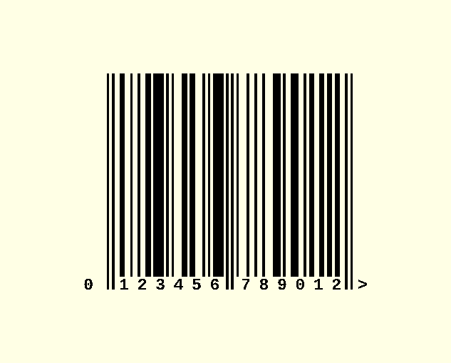
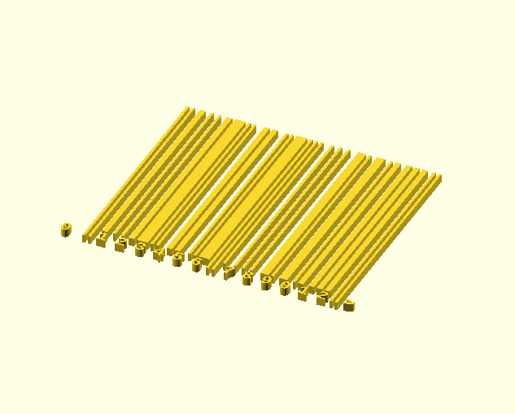

# UPC-A and EAN-13 User Guide
This user-guide provides examples of how to use [upc.scad](../barcodes/upc.scad)
to generate UPC and EAN-13 barcodes.  
Further information can be found by examining [upc.scad](../barcodes/upc.scad)
and related libraries like [bitmap.scad](../util/bitmap.scad)

## Table of Contents
* [UPC-A](#upc-a)
  - [UPC-A Basic Example](#upc-a-basic-example)
  - [UPC-A Module Description](#upc-a-module-description)
  - [UPC-A Helper Functions](#upc-a-helper-functions)
  - [UPC-A Checkdigit Handling](#upc-a-checkdigit-handling)
* [EAN-13](#ean-13)
  - [EAN-13 Basic Example](#ean-13-basic-example)
  - [EAN-13 Module Description](#ean-13-module-description)
  - [EAN-13 Helper Functions](#ean-13-helper-functions)
  - [EAN-13 Checkdigit Handling](#ean-13-checkdigit-handling)
  - [EAN-13 Quiet Arrow](#ean-13-quiet-arrow)
* [Extended Examples](#extended-examples)
  - [Font Handling](#font-handling)
  - [Rendering Options](#rendering-options)
  - [Vector Mode](#vector-mode)

---

## UPC-A
The [Universal Product Code](https://w.wiki/8WaG) is a barcode symbology that is
widely used for tracking items  in stores.  
A UPC-A consists of 11 digits and a check digit. No letters, characters, control
codes, or typographic symbols are allowed.
The UPC-A barcode (or symbol) is normally represented with a sequence of black
bars and white spaces.

### UPC-A Basic Example
Include upc.scad in your model with the `use` command.  
Provide a string of 11 digits as the parameter to the `UPC_A` module.

```
use <barcodes/upc.scad>
UPC_A("01234554321");
```


### UPC-A Module Description
```
module UPC_A(string,
	bar=1, space=0, quiet_zone=0,
	pullback=-0.003,
	vector_mode=false,
	center=false,
	font="Liberation Mono:style=Bold", fontsize=1.5)
```

This module generates the geometry for the UPC-A barcode with the supplied
parameters.
* `string`: a string of 11 or 12 digits to be encoded
  - if the conversion to digits fails to result in 11 or 12 digits, an error will be generated
  - if the 12th digit is provided and represents an incorrect check digit for the other 11 digits, a warning will be generated
* `bar`: representational unit for bars in the symbol
  - defaults to 1, a 1 mm tall block
  - can also be usefully set to "black" to generate black bars
* `space`: representation unit for spaces in the symbol
  - defaults to 0, which generates no geometry
  - can also usefully be set to "white" to generate white fill between bars
* `quiet_zone`: representation unit for the quiet zone around the symbol
  - defaults to 0, which generates no geometry
  - can also usefully be set to "white" to generate white fill on both sides of the symbol
* `pullback`: a factor to apply to the individual modules of the symbol
  - it isn't normally necessary to modify this parameter
  - defaults to -0.003, which expands the modules slightly so that they will reliably combine into merged geometry
  - a positive pullback would shrink the modules slightly so that the wide bars would have gaps between the individual modules
* `vector_mode`: determines whether to generate 2D geometry rather than 3D
  - defaults to false
* `center`: determines whether to center the symbol on the origin
  - defaults to false
* `font`: font and style to use
  - defaults to "Liberation Mono:style=Bold"
  - can also usefully be set to `undef`
* `fontsize`: size of the font
  - defaults to 1.5 mm


### UPC-A Helper Functions
```
SYMBOL_FULL_HEIGHT = 24.5;

function UPC_A_width()
```

The `SYMBOL_FULL_HEIGHT` variable represents the nominal height (in mm) of the
generated symbol.

The `UPC_A_width` function computes the width (in mm) of the generated symbol
(including quiet zone).  

> 🪧 Note: The width is always 37.29 mm, but the function computes it for
> completeness. If the `MODULE_WIDTH` in the software is modified, the modified
> width will automatically be computed correctly.

### UPC-A Checkdigit Handling
The check digit can be computed automatically. Simply provide a string of 11
digits and the 12th checkdigit will automatically be determined.  
For example, these 2 commands generate the same barcode geometry:
```
UPC_A("01234554321", bar="black");
UPC_A("012345543210", bar="black");
```


If an incorrect checkdigit is supplied, then a warning will be emitted in the
OpenSCAD console like `ECHO: "WARNING: incorrect check digit supplied 3!=1"`.  
In spite of the warning, the invalid barcode geometry will still be emitted.

---

## EAN-13
The [EAN](https://w.wiki/8WbT) is a barcode symbology that is a superset of the
UPC-A codes.  
EAN-13 consists of 12 digits and a check digit. No letters, characters, control
codes, or typographic symbols are allowed.  
The EAN-13 barcode (or symbol) is normally represented with a sequence of black
bars and white spaces.  
Every UPC-A can be converted into an equivalent EAN-13 by prepending a 0 digit
to the UPC-A. In spite of this extra digit, the symbol is encoded with the same
number of modules as UPC-A. The additional digit is encoded within the parity
of the other digits.

### EAN-13 Basic Example
Include upc.scad in your model with the `use` command.  
Provide a string of 12 digits (with optional ">") as the parameter to the
`EAN_13` module.

```
use <barcodes/upc.scad>
EAN_13("012345678901>");
```



### EAN-13 Module Description
```
module EAN_13(string,
	bar=1, space=0, quiet_zone=0,
	pullback=-0.003,
	vector_mode=false,
	center=false,
	font="Liberation Mono:style=Bold", fontsize=1.5)
```

This module generates the geometry for the EAN-13 barcode with the supplied
parameters.
* `string`: a string of 12 GTIN digits to be encoded (or 13 digits if the checkdigit is included)
  - if the conversion to digits fails to result in 12 or 13 digits, an error will be generated
  - if the 13th digit is provided and represents an incorrect check digit for the other 12 digits, a warning will be generated
* `bar`: representational unit for bars in the symbol
  - defaults to 1, a 1 mm tall block
  - can also be usefully set to "black" to generate black bars
* `space`: representation unit for spaces in the symbol
  - defaults to 0, which generates no geometry
  - can also usefully be set to "white" to generate white fill between bars
* `quiet_zone`: representation unit for the quiet zone around the symbol
  - defaults to 0, which generates no geometry
  - can also usefully be set to "white" to generate white fill on both sides of the symbol
* `pullback`: a factor to apply to the individual modules of the symbol
  - it isn't normally necessary to modify this parameter
  - defaults to -0.003, which expands the modules slightly so that they will reliably combine into merged geometry
  - a positive pullback would shrink the modules slightly so that the wide bars would have gaps between the individual modules
* `vector_mode`: determines whether to generate 2D geometry rather than 3D
  - defaults to false
* `center`: determines whether to center the symbol on the origin
  - defaults to false
* `font`: font and style to use
  - defaults to "Liberation Mono:style=Bold"
  - can also usefully be set to `undef`
* `fontsize`: size of the font
  - defaults to 1.5 mm

### EAN-13 Helper Functions
```
SYMBOL_FULL_HEIGHT = 24.5;

function EAN_13_width()
```

The `SYMBOL_FULL_HEIGHT` variable represents the nominal height (in mm) of the
generated symbol.

The `EAN_13_width` function computes the width (in mm) of the generated symbol
(including quiet zone).  

> 🪧 Note: The width is always 37.29 mm, but the function computes it for
> completeness. If the `MODULE_WIDTH` in the software is modified, the modified
> width will automatically be computed correctly.

### EAN-13 Checkdigit Handling
The check digit can be computed automatically. Simply provide a string of 12
digits and the 13th checkdigit will automatically be determined.  
For example, these 2 commands generate the same barcode geometry:
```
EAN_13("012345678901>", bar="black");
EAN_13("0123456789012>", bar="black");
```


If an incorrect checkdigit is supplied, then a warning will be emitted in the
OpenSCAD console like `ECHO: "WARNING: incorrect check digit supplied 3!=1"`.  
In spite of the warning, the invalid barcode geometry will still be emitted.

### EAN-13 Quiet Arrow
The ">" symbol in the example images indicates the right-side quiet zone.
This can help avoid encroachment on the quiet zone but is, otherwise,
functionally irrelevant. In UPC-A, the checkdigit appears in the right-side
quiet zone but, in EAN-13, the checkdigit has moved inside the right end marker.

In this software, the right quiet zone indicator can optionally be emitted or
suppressed. Simply include it at the end of the string if you want it to be
emitted.  
For example, these 2 commands generate the same barcode geometry, but the first
suppresses the right quiet zone indicator and the second emits it:
```
EAN_13("012345678901", bar="black");
EAN_13("012345678901>", bar="black");
```


Of course, this can also be combined with the
[manual checkdigit handling](#ean-13-checkdigit-handling).
As expected, these will all result in the same barcode geometry with the only
difference being the presence or absence of the right quiet zone indicator:
```
EAN_13("012345678901", bar="black");
EAN_13("012345678901>", bar="black");
EAN_13("0123456789012", bar="black");
EAN_13("0123456789012>", bar="black");
```

---

## Extended Examples

### Font Handling
The font used for the digits can be changed if desired. Use _Help_->_Font List_
to see a menu of available fonts on your system. The font name and style can be
passed to the `font` parameter in the `UPC_A` or `EAN_13` modules. The format of the string passed to the `font` parameter should be "_fontname_" or
"_fontname_:style=_fontstyle_".   
In some cases, when changing the font, it may be necessary to scale the font to
fit it beneath the symbol. This can be done by passing a value to the `fontsize`
parameter.

For example, this command will use an OCR-B font:
```
EAN_13("012345678901>", bar="black", font="OCRB", fontsize=1.4);
```


Additionally, you may want to suppress the display of the digits below the
symbol. This can be done by setting the `font` parameter to `undef`:
```
EAN_13("012345678901>", bar="black", font=undef);
```


### Rendering Options
The `bar`, `space`, and `quiet_zone` parameters can be used to modify the generated geometry or the preview rendering. The general expectation is that the
symbol will be embossed or debossed on another object. For this reason, the
default parameters result in a simple 1-unit-tall geometry for the bars and no
geometry for the spaces and quiet zone.  
However, it can be helpful to color the symbol for reasons that I haven't
anticipated. (And, at the very least, it can help make your screen-shots look
prettier.)

Each of these parameters can take a rational value that represents the height of
the respective geometry.  
For example:
```
EAN_13("012345678901>", bar=5, space=3, quiet_zone=1);
```


Likewise, each of them can take a string value that represents a color. There is
a description of valid hex strings and a list of standard color names
available in the [OpenSCAD User Manual](https://en.wikibooks.org/wiki/OpenSCAD_User_Manual/Transformations#color).

> 🪧 Note: OpenSCAD only displays colors in the preview. When rendering the
> object, the color information will be discarded.


Example:
```
EAN_13("012345678901>", bar="#000", space="white", quiet_zone="#A0BBF0B0");
```


Finally, a 3- or 4-vector can be passed to these parameters to indicate the
desired color as [R, G, B] or [R, G, B, A]. (Note: values for each color channel
are expressed as rational numbers between 0.0 and 1.0.)  
This example represents the same colors as the previous example:
```
EAN_13("012345678901>", bar=[0,0,0], space=[1,1,1],
	quiet_zone=[0.625, 0.73, 0.9375, 0.6875]);
```

### Vector Mode
The `UPC_A` and `EAN_13` modules will emit 2D geometry rather than 3D if you
pass a value of true in the `vector_mode` parameter:
```
EAN_13("012345678901>", bar="black", vector_mode=true);
```


> 🪧 Note:  
> Although OpenSCAD supports generating 2D geometry, there are several caveats:
> * 2D and 3D geometry cannot be mixed in the same design
> * Extruding 2D geometry causes loss of color information
> * Previewing 2D geometry makes it appear as though it is 1 unit tall and centered on the z-axis
> * Rendering 2D geometry properly displays it as a flat object but results in the loss of color information
> * The exporters for 2D geometry are somewhat limited
>   - See the note in [bitmap.scad](../util/bitmap.scad) for some work-arounds
